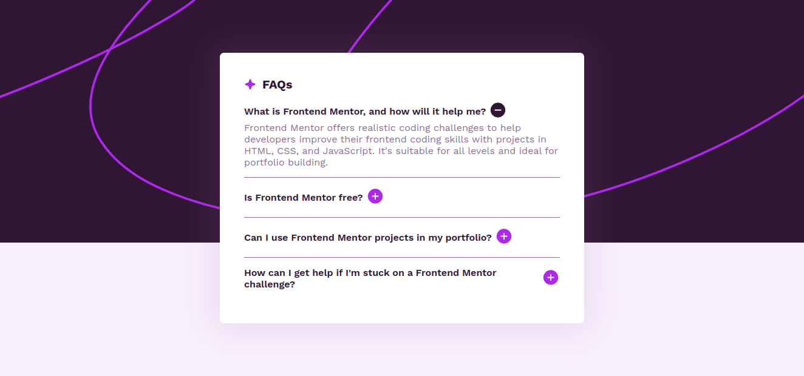

# Frontend Mentor - FAQ accordion solution

This is a solution to the [FAQ accordion challenge on Frontend Mentor](https://www.frontendmentor.io/challenges/faq-accordion-wyfFdeBwBz). Frontend Mentor challenges help you improve your coding skills by building realistic projects.

## Table of contents

- [Overview](#overview)
  - [The challenge](#the-challenge)
  - [Screenshot](#screenshot)
  - [Links](#links)
- [My process](#my-process)
  - [Built with](#built-with)
  - [What I learned](#what-i-learned)
  - [Continued development](#continued-development)
- [Author](#author)

## Overview

### The challenge

Users should be able to:

- Hide/Show the answer to a question when the question is clicked
- Navigate the questions and hide/show answers using keyboard navigation alone
- View the optimal layout for the interface depending on their device's screen size
- See hover and focus states for all interactive elements on the page

### Screenshot



### Links

- Solution URL: [GitHub](https://github.com/ronitzdev/faq-accordion?tab=readme-ov-file)
- Live Site URL: [Live](https://faq-accordion-ronitzdev.netlify.app/)

## My process

### Built with

- Semantic HTML5 markup
- CSS custom properties
- Flexbox
- CSS Grid
- Mobile-first workflow

### What I learned

Add image by css, with custom values in body in fewer lines of code and with the ability to be one css layer below using pseudo element ::after

```css
body::after {
    content: "";
    background: url(../assets/images/background-pattern-desktop.svg) no-repeat center / cover;
    width: 100%;
    height: 400px;
    position: absolute;
    top: 0;
    z-index: -10;
}
```

### Continued development

I am currently focusing on the basics of html, css, javascript until I master most of the essential concepts, and then work with a framework.

## Author

- GitHub - [ronitzdev](https://github.com/ronitzdev)
- Frontend Mentor - [@ronitzdev](https://www.frontendmentor.io/profile/ronitzdev)
- LinkedIn - [@ronitzdev](https://www.linkedin.com/in/ronitzdev/)
